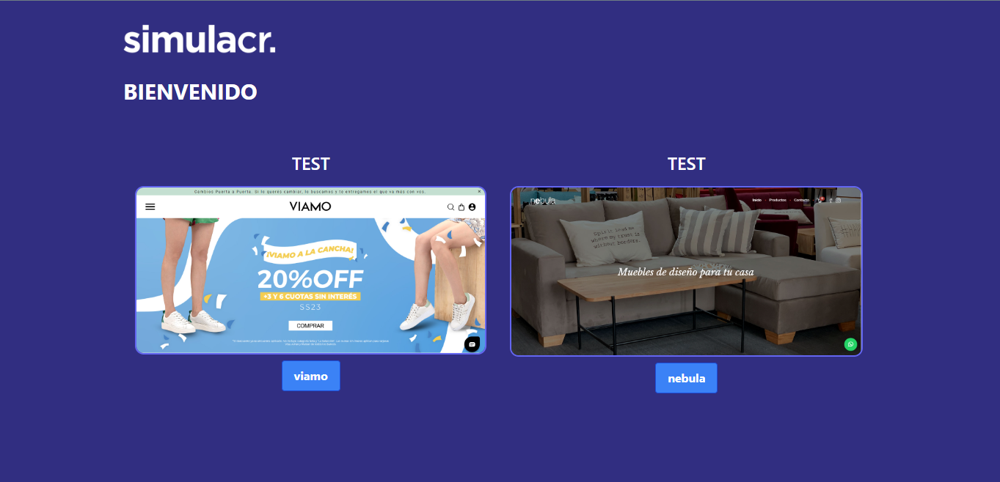

<p align="center">
  
</p>


## Challenge greydive.
### Requerimientos

Realizar una app en React.js que lea este archivo JSON () y genere por cada ítem, una nueva url o ruta con todas sus propiedades como el siguiente ejemplo:

Link

Cada nueva URL, debe contener todos los datos de un test:

- Cliente
- Url del video
- Tareas
- Transcripción

En cuanto a diseño, puede ser igual al del ejemplo o distinto. Como prefieras.

<p align="left"><strong>Para Instalación de Dependencias:</strong></p>
<h5>
 Clonar este repositorio (`https://github.com/FdR-23/Challenge-greydive`)
 
```bash
 cd challenge-rappi
 •  npm install
 •  npm run start
 ```
</h5>

<p align="left"><strong>Deploy</strong></p> 
(https://challenge-greydive-black.vercel.app/)

<p align="left"><strong>Dependencias Utilizadas:</strong></p> 

* **React**
* **React Router**
* **Tailwind CSS**


## Authors

* **Federico Rampi**